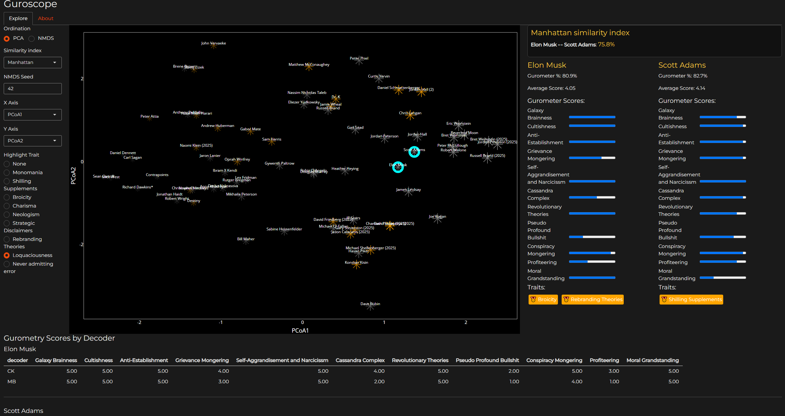

# Guroscope
Interactive R Shiny web app that visualizes Gurometry score profiles of secular gurus rated by the Decoding the Gurus podcast using ordination methods In the app the Gurus appear as selectable "stars" in 2D "guruscape" where similarly scored gurus group close together. clicking the stars allows side-by-side comparisons of Gurus profiles ( decoder averages). The gurometry scores per decoder are displayed as table below the "guruscape". For plotting the 2d "guruscape", the gurometry scores from all decoders are first averaged and then dimension reduction technique, currently the first two major axis of PCA are used for ordination.

Screenshot of Guroscope:

## Features of the app
- Data pulled (and cleaned) directly from Google Sheets  
- Interactive Guruscape  (2D ordination plot using different ordination methods). Currently only Principal Component Analysis PCA is functional. by default PCA1 and PCA2 axis are used for ordination as PCA captures most of the differences between gurometry scores most of the variation is captured by PCA1 meaning high scoring gurus cluster on one end while low scoring gurus on the other end of PCA1. PCA2 might most be on shilling supplements.
- Clickable stars (gurus) to explore individual profiles. The Guru profiles view on right hand panel. individual gurometry scores by different decoders display in bottom panel.
- Binary traits (e.g., "Monomania", "Broicity") color-coded may be highligted as different coloured stars in the "guroscape".
- May be deployed and hosted on server using [Shiny](https://shiny.posit.co/)

## Installation

1.Make sure you have R and RStudio installed. 

2.Then install required packages in R:

install.packages(c("shiny", "bslib", "dplyr", "tidyr", "readr", "stringr",
                   "googlesheets4", "vegan", "ggplot2", "RColorBrewer", "ggrepel"))
                
3. Clone the repo and run the app from your R console or RStudio. Or simply copy paste all the code in R-studio and run the app.R script if all dependencies are installed.

### Data Source
Data is fetched directly from this public Google Sheet:
[Gurometer Scores - Decoding the Gurus](https://docs.google.com/spreadsheets/d/1Oe-af4_OmzLJavktcSKGfP0wmxCX0ppP8n_Tvi9l_yc/edit?gid=0#gid=0) 

#### Used libraries:
R Shiny – Interactive UI and web deployment
ggplot2 – Visualization
vegan – Ordination (PCA/NMDS)
googlesheets4 – Real-time data import
bslib – Custom Bootstrap 5 theme

#### Work in progress::: list of potential features & stuff to be added

Guru sidepanel (right panel): 
* Rework how gurometry scores are compared and visualized. get rid of redundant headers. 
* Add Automated highlighting  of the main differences between chosen Gurus gurumetry scores 

Main plot / "Guruscape"
* Adjust the cursor icon for easier selection of gurus from the guruscape for comparisons
* add functionality to plot single attribute comparisons as biplot scores (as arrows) on the ordination plot 
* adding functional NMDS ordination and maybe some other ordination methods to the plot

Other stuff
*separate tab for cluster analysis for some Guru phylogeny visualizations

##### What Is Gurometry?

*Gurometry* is a satirical rating framework developed by [Chris Kavanagh](https://twitter.com/C_Kavanagh) and [Matt Browne](https://twitter.com/ArthurCDent) for their podcast *Decoding the Gurus*. It rates self-proclaimed intellectuals or “secular gurus” based on recurring traits like "Galaxy Brainness" and "Conspiracy Mongering."

For more on Gurometry, listen to the podcast or view their [Google Sheet](https://docs.google.com/spreadsheets/d/1Oe-af4_OmzLJavktcSKGfP0wmxCX0ppP8n_Tvi9l_yc).

###### Credits
Gurometry: by Chris Kavanagh & Matt Browne, from the Decoding the Gurus podcast
Cursor icon: Illuminati icon by Icons8

This project is for entertainment purposes only. It is not affiliated with or endorsed by the Decoding the Gurus podcast.

